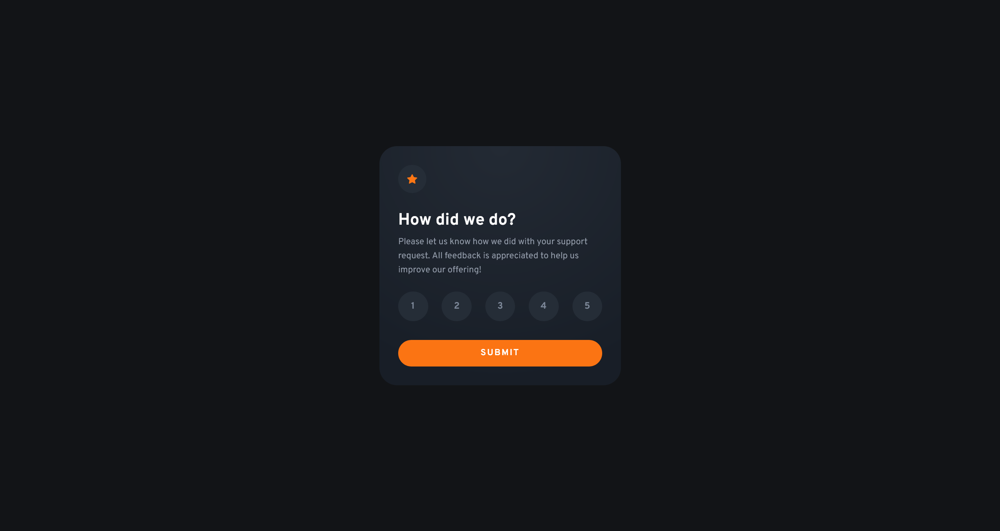

# Frontend Mentor - Interactive rating component solution

This is a solution to the [Interactive rating component challenge on Frontend Mentor](https://www.frontendmentor.io/challenges/interactive-rating-component-koxpeBUmI). Frontend Mentor challenges help you improve your coding skills by building realistic projects. 

## Table of contents

- [Frontend Mentor - Interactive rating component solution](#frontend-mentor---interactive-rating-component-solution)
  - [Table of contents](#table-of-contents)
  - [Overview](#overview)
    - [The challenge](#the-challenge)
    - [Screenshot](#screenshot)
    - [Links](#links)
  - [My process](#my-process)
    - [Built with](#built-with)
    - [Useful resources](#useful-resources)
  - [Author](#author)

## Overview

### The challenge

Users should be able to:

- View the optimal layout for the app depending on their device's screen size
- See hover states for all interactive elements on the page
- Select and submit a number rating
- See the "Thank you" card state after submitting a rating

### Screenshot

### Links

- Solution URL: [Frontend Mentor](https://www.frontendmentor.io/solutions/interactive-rating-component-with-bootstrap-mmVcwLG4x8)
- Live Site URL: [Github page](https://manondupriez.github.io/Interactive-rating-component/)

## My process

### Built with

- HTML
- CSS/SCSS
- Bootstrap
- JavaScript vanilla
- Mobile-first workflow

### Useful resources

- [CSS Previous sibling](https://medium.com/free-code-camp/how-to-make-the-impossible-possible-in-css-with-a-little-creativity-bd96bb42b29d) - In CSS, there is no way to select the previous element. This article helped me select the previous items using Flexbox and apply CSS to them.

## Author

- Frontend Mentor - [@manondupriez](https://www.frontendmentor.io/profile/manondupriez)